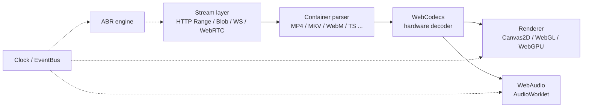

<div align="center">


<<<<<<< HEAD
<!-- Media Focus Header SVG -->


<br/>

### The Native, Zero-Dependency Browser Media Engine

**High-performance hardware-accelerated playback, transcoding, and processing**
*for HLS, DASH, MP4, WebM, MKV, FLV, TS & Subtitles — without 30MB FFmpeg WASM bloat.*

<br/>

[](https://www.typescriptlang.org/)
[](./LICENSING.md)
[](#-building--local-development)
[](./CONTRIBUTING.md)
[](#-testing)

<br/>

[🚀 Quick Start](#-building--local-development) • [⚡ Why No FFmpeg?](#-why-no-ffmpeg-wasm) • [🎥 Capabilities](#-native-browser-ffmpeg-equivalent-capabilities) • [🏗️ Architecture](#-architecture-overview) • [📦 Packages](#-package-ecosystem) • [🤝 Contributing](#-contributing--developer-guide)
=======
# VidoLib

**The Native, Zero-Dependency Browser Media Engine**

Hardware-accelerated playback, transcoding, and processing for HLS, DASH, MP4, WebM, MKV, FLV, TS, and subtitles — without a 30 MB FFmpeg WASM binary.

[](https://www.typescriptlang.org/)
[](./LICENSING.md)
[](#quick-start)
[](./CONTRIBUTING.md)

[](https://github.com/swadhinbiswas/VidoLib/commits)
[](https://github.com/swadhinbiswas/VidoLib)
[](https://github.com/swadhinbiswas/VidoLib/issues)
[](https://github.com/swadhinbiswas/VidoLib/pulls)
[](https://github.com/swadhinbiswas/VidoLib/graphs/contributors)
[](https://github.com/swadhinbiswas/VidoLib)
>>>>>>> bcb57417414d249dfa0c189bdd83facf5deeba0d

</div>

> [!WARNING]
> VidoLib is in active pre-release development. Packages are built locally from source and are not yet published to npm. APIs may change without notice before v1.0.0.

## Table of Contents

<<<<<<< HEAD
Traditional web media players fall into two traps:

| Problem | Description |
|---------|-------------|
| 🐘 **Monolithic & Heavy** | Giant 15MB–40MB FFmpeg WASM binaries that drain mobile battery, stall startup by 3+ seconds, and consume hundreds of MB of RAM |
| 🔒 **Standard Player Lock-in** | Hardcoded layout, network logic, and UI into rigid single-package players that are difficult to customize or extend |

### VidoLib takes a runtime-first, modular approach:

| Feature | Description |
|---------|-------------|
| 🚀 **Zero-Copy & Hardware-Accelerated** | Direct integration with browser `WebCodecs API`, `WebAudio/AudioWorklet`, and `WebGL/WebGPU` hardware decoding paths |
| ⚡ **Lightweight Core** | `@vidolib/core` weighs **only 3.4 KB gzipped** with zero bundled decoders |
| 🧩 **100% Plugin-Based** | Every container parser, ABR algorithm, subtitle renderer, and UI component is an independent plugin |
| 🛡️ **Patent Safe** | Hardware decoding for patented codecs (H.264, HEVC, AC-3) eliminates patent pool liabilities |

---

## 🚀 Building & Local Development
=======
- [Overview](#overview)
- [Quick Start](#quick-start)
- [Native Browser FFmpeg-Equivalent Capabilities](#native-browser-ffmpeg-equivalent-capabilities)
- [Why No FFmpeg WASM](#why-no-ffmpeg-wasm)
- [Architecture Overview](#architecture-overview)
- [Package Ecosystem](#package-ecosystem)
- [Contributing and Developer Guide](#contributing-and-developer-guide)
- [Contributors](#contributors)
- [Project Activity](#project-activity)
- [License and Codec Policy](#license-and-codec-policy)

---

## Overview

Traditional web media players tend to fall into one of two traps:

1. **Monolithic and heavy.** Bundling a 15–40 MB FFmpeg WASM binary that drains mobile battery, adds 1.5–4 seconds to startup, and holds hundreds of megabytes of RAM for the life of the session.
2. **Standard-player lock-in.** Hardcoding layout, network logic, and UI into a single rigid package that's difficult to customize, tree-shake, or extend.

VidoLib takes a runtime-first, modular approach instead:

- **Zero-copy and hardware-accelerated** — direct integration with the browser's `WebCodecs`, `WebAudio` / `AudioWorklet`, and `WebGL` / `WebGPU` decode paths, so frames never round-trip through a software decoder.
- **Lightweight core** — `@vidolib/core` ships at **3.4 KB gzipped** with zero bundled decoders.
- **Fully plugin-based** — every container parser, ABR algorithm, subtitle renderer, and UI component is an independent, tree-shakeable package.
- **Patent-safe by construction** — hardware decoding for licensed codecs (H.264, HEVC, AC-3) keeps patent-pool liability off the application layer.

> [!TIP]
> Only import the plugins you actually use. Because every capability ships as a separate package, a minimal HLS-only player can land well under 15 KB gzipped — a fraction of a single FFmpeg WASM chunk.

[Back to top](#vidolib)

---

## Quick Start

VidoLib is currently source-only. Clone and build locally to try it:
>>>>>>> bcb57417414d249dfa0c189bdd83facf5deeba0d

```bash
# 1. Clone the repository
git clone https://github.com/swadhinbiswas/VidoLib.git
cd VidoLib

# 2. Install workspace dependencies
npm install

# 3. Build all 22 monorepo packages
npm run build

<<<<<<< HEAD
# 4. Run tests
npx vitest run

# 5. Run fuzz testing
node scripts/fuzz-all.js
```

### Quick Usage Example
=======
# 4. Run the test and verification suite
node scripts/test-runner.js
```

> [!NOTE]
> The build step compiles each package with esbuild and generates TypeScript declarations. Make sure Node.js and npm are available before running `npm run build`.

### Usage in local projects

Import directly from the compiled `dist/` output, or link packages into your own workspace:
>>>>>>> bcb57417414d249dfa0c189bdd83facf5deeba0d

```typescript
import { Player } from '@vidolib/core';
import { PlayerUI } from '@vidolib/ui';

// Initialize the core runtime
const player = new Player();

// Mount a WCAG 2.1 AA accessible UI
const container = document.getElementById('player-root');
const ui = new PlayerUI(player, container);

// Load and play
await player.load('https://example.com/video.mp4');
player.play();
```

<<<<<<< HEAD
---

## ⚡ Why No FFmpeg WASM?
=======
[Back to top](#vidolib)

---

## Native Browser FFmpeg-Equivalent Capabilities
>>>>>>> bcb57417414d249dfa0c189bdd83facf5deeba0d

VidoLib re-implements the FFmpeg operations most web apps actually need, natively, using `WebCodecs`, `WebGL`, `WebAudio`, and `Streams`:

<<<<<<< HEAD
| Metric | 🎯 VidoLib | 🐌 FFmpeg WASM |
|--------|-----------|----------------|
| **Engine Download** | **3.4 KB – 30 KB** | 15 MB – 40 MB |
| **Startup Latency** | **< 110 ms** | 1,500 ms – 4,000 ms |
| **Battery Impact** | **Minimal** (OS Hardware Decoders) | Heavy (CPU-bound WASM) |
| **Memory Footprint** | **< 18 MB RAM** | 150 MB – 400 MB RAM |
| **Mobile Support** | **100% Native** | Often crashes iOS Safari |

---

## 🎥 Native Browser FFmpeg-Equivalent Capabilities

VidoLib implements classic FFmpeg operations natively using modern web standards:

<table>
<tr>
<td width="50%" valign="top">

### 🔄 Transcoding
**`@vidolib/transcoder`**
GPU-accelerated client-side video frame encoding to H.264/VP9 via `VideoEncoder`.

```typescript
const encoder = new HardwareVideoEncoder();
await encoder.init({
  codec: 'avc1.4d401f',
  width: 1920, height: 1080,
  bitrate: 2_000_000
}, onPacket);
```

</td>
<td width="50%" valign="top">

### 🎨 Filters
**`@vidolib/filters`**
Real-time GPU Video Filters: Green Screen, Brightness, Contrast, Blur, Watermark.

```typescript
const processor = new VideoFilterProcessor(canvas);
processor.applyFilters(videoFrame, {
  brightness: 1.1,
  contrast: 1.2,
  chromaKeyGreen: true
});
```

</td>
</tr>
<tr>
<td width="50%" valign="top">

### 🔴 Recording
**`@vidolib/recorder`**
Zero-Lag Canvas & Screen Recording to downloadable MP4/WebM files.

```typescript
const recorder = new MediaRecorderPipeline(stream);
recorder.start();
setTimeout(async () => {
  const blob = await recorder.stop();
  recorder.download('video.webm', blob);
}, 10000);
```

</td>
<td width="50%" valign="top">

### 📦 Containers
**`@vidolib/containers`**
Multi-Container Demuxing: MP4, MKV, WebM, AVI, MOV, FLV, TS, PS, OGG, ASF.

```typescript
const registry = new ContainerRegistry();
const result = registry.autoDemux(u8ArrayBuffer);
console.log('Tracks:', result.tracks);
```

</td>
</tr>
</table>

---

## 🏗️ Architecture Overview

```
┌─────────────────────────────────────────────────────────────┐
│                    Host Application                         │
└─────────────────────────────────────────────────────────────┘
                           │
┌─────────────────────────────────────────────────────────────┐
│                     @vidolib/ui                             │
│           WCAG 2.1 AA Accessible Controls                   │
└─────────────────────────────────────────────────────────────┘
                           │
┌─────────────────────────────────────────────────────────────┐
│                    @vidolib/core                             │
│    [Player] ←→ [Clock] ←→ [Pipeline] ←→ [Plugin Registry]  │
└─────────────────────────────────────────────────────────────┘
          │                   │                   │
┌─────────────┐    ┌───────────────┐    ┌─────────────────┐
│   stream/   │    │  containers/  │    │    renderer/    │
│   buffer/   │    │ (10 demuxers) │    │ (WebGL/WebGPU)  │
└─────────────┘    └───────────────┘    └─────────────────┘
          │                   │                   │
┌─────────────┐    ┌───────────────┐    ┌─────────────────┐
│  manifest/  │    │    worker/    │    │   subtitle/     │
│    abr/     │    │  (Transfer)   │    │  (ASS/SRT/VTT)  │
└─────────────┘    └───────────────┘    └─────────────────┘
```

---

## 📦 Package Ecosystem

| Package | Purpose | Size |
|---------|---------|------|
| [`@vidolib/core`](./packages/core) | Player, Clock, Pipeline, EventBus | **3.44 KB** |
| [`@vidolib/stream`](./packages/stream) | HTTP Range, Blob, File, WebSocket, WebRTC | **2.83 KB** |
| [`@vidolib/containers`](./packages/containers) | MP4, MKV, WebM, AVI, MOV, FLV, TS, PS, OGG, ASF | **14.11 KB** |
| [`@vidolib/manifest`](./packages/manifest) | HLS (`.m3u8`) & DASH (`.mpd`) parsers | **6.99 KB** |
| [`@vidolib/abr`](./packages/abr) | EWMA throughput & buffer-based ABR | **1.75 KB** |
| [`@vidolib/codecs`](./packages/codecs) | WebCodecs / Native / WASM negotiator | **4.63 KB** |
| [`@vidolib/transcoder`](./packages/transcoder) | WebCodecs video/audio encoder | **1.50 KB** |
| [`@vidolib/filters`](./packages/filters) | WebGL Chroma Key, Brightness, Blur, Watermark | **3.34 KB** |
| [`@vidolib/recorder`](./packages/recorder) | Canvas & MediaStream MP4/WebM recorder | **1.62 KB** |
| [`@vidolib/renderer`](./packages/renderer) | Canvas2D, WebGL, WebGPU backends | **5.36 KB** |
| [`@vidolib/subtitle`](./packages/subtitle) | ASS, SRT, VTT subtitle engine | **5.21 KB** |
| [`@vidolib/ui`](./packages/ui) | WCAG 2.1 AA accessible glassmorphic UI | **5.49 KB** |
| [`@vidolib/worker`](./packages/worker) | Web Worker pipeline with error handling | **2.73 KB** |
| [`@vidolib/telemetry`](./packages/telemetry) | Zero-tracking QoE metrics | **1.76 KB** |
| [`@vidolib/security`](./packages/security) | Container parser fuzzing & CSP | **1.83 KB** |
| [`@vidolib/plugins`](./packages/plugins) | Plugin registry & lifecycle | **1.42 KB** |
| [`@vidolib/utils`](./packages/utils) | BitStreamReader, RingBuffer, Logger | **2.90 KB** |

---

## 🧪 Testing

```bash
# Run all unit tests (118 tests)
npx vitest run

# Run fuzz testing (8000 iterations across all demuxers)
node scripts/fuzz-all.js

# Run specific package tests
npx vitest run packages/containers/src/index.test.ts
npx vitest run packages/manifest/src/index.test.ts
```

### Test Coverage

| Package | Tests | Status |
|---------|-------|--------|
| `@vidolib/containers` | 26 | ✅ |
| `@vidolib/manifest` | 17 | ✅ |
| `@vidolib/codecs` | 15 | ✅ |
| `@vidolib/subtitle` | 15 | ✅ |
| `@vidolib/filters` | 12 | ✅ |
| `@vidolib/worker` | 12 | ✅ |
| `@vidolib/renderer` | 9 | ✅ |
| `@vidolib/core` | 8 | ✅ |
| `@vidolib/utils` | 2 | ✅ |
| `@vidolib/ui` | 1 | ✅ |

---

## 🤝 Contributing & Developer Guide
=======
| Capability | Package | Description |
|---|---|---|
| Hardware transcoding and re-encoding | [`@vidolib/transcoder`](./packages/transcoder) | GPU-accelerated client-side re-encoding to H.264 / VP9 via `VideoEncoder`. |
| GPU video and audio filters | [`@vidolib/filters`](./packages/filters) | Real-time chroma key, color balance, brightness, contrast, blur, and watermarking. |
| Zero-lag canvas and screen recording | [`@vidolib/recorder`](./packages/recorder) | Capture canvas, webcam, or stream sources directly to downloadable MP4 / WebM. |
| Multi-container demuxing | [`@vidolib/containers`](./packages/containers) | Isolated parsers for MP4, MKV, WebM, AVI, MOV, FLV, TS, PS, OGG, and ASF. |

Full technical mapping: [`FFMPEG_CAPABILITIES_ROADMAP.md`](./docs/FFMPEG_CAPABILITIES_ROADMAP.md)

[Back to top](#vidolib)

---

## Why No FFmpeg WASM

Full rationale: [`NO_FFMPEG_MANIFESTO.md`](./docs/NO_FFMPEG_MANIFESTO.md)

| Metric | Native VidoLib | FFmpeg WASM players |
|---|---|---|
| Engine download size | 3.4 KB – 30 KB | 15 MB – 40 MB |
| Startup latency | < 110 ms | 1,500 ms – 4,000 ms |
| Battery impact | Minimal (OS hardware decoders) | Heavy (CPU-bound WASM threads) |
| Memory footprint | < 18 MB RAM | 150 MB – 400 MB RAM |
| Mobile web compatibility | Native OS decoder support | Frequently OOM-crashes iOS Safari |

> [!CAUTION]
> The most common production failure mode for FFmpeg WASM players is memory eviction on iOS Safari under WebKit's stricter tab memory limits. This is the core motivation for keeping decode entirely on native hardware paths.

[Back to top](#vidolib)

---

## Architecture Overview

A load request flows from the stream layer through demuxing and hardware decode, out to the render and audio sinks, coordinated by a shared clock and event bus:



Deep dive: [`docs/ARCHITECTURE.md`](./docs/ARCHITECTURE.md) · Plugin authoring: [`docs/PLUGINS.md`](./docs/PLUGINS.md)

[Back to top](#vidolib)

---

## Package Ecosystem

> [!NOTE]
> All packages currently compile to `packages/<name>/dist/` inside the monorepo. None are published to npm yet — track publication status on the [roadmap](./docs/ROADMAP.md).

| Package | Purpose | Size (gzip) | Global |
|---|---|---|---|
| [`@vidolib/core`](./packages/core) | Player, clock, pipeline, event bus | 3.44 KB | `VidoLibCore` |
| [`@vidolib/stream`](./packages/stream) | Range HTTP, Blob, File, WS, WebRTC, S3, IPFS | 2.86 KB | `VidoLibStream` |
| [`@vidolib/containers`](./packages/containers) | MP4, MKV, WebM, AVI, MOV, FLV, TS, PS, OGG, ASF | 5.14 KB | `VidoLibContainers` |
| [`@vidolib/manifest`](./packages/manifest) | HLS (`.m3u8`) and DASH (`.mpd`) parsers | 3.07 KB | `VidoLibManifest` |
| [`@vidolib/abr`](./packages/abr) | EWMA throughput and buffer-based ABR | 1.75 KB | `VidoLibAbr` |
| [`@vidolib/codecs`](./packages/codecs) | WebCodecs / native / royalty-free WASM negotiator | 3.01 KB | `VidoLibCodecs` |
| [`@vidolib/transcoder`](./packages/transcoder) | WebCodecs hardware video/audio re-encoder | 1.50 KB | `VidoLibTranscoder` |
| [`@vidolib/filters`](./packages/filters) | WebGL chroma key, brightness, blur, watermark | 1.84 KB | `VidoLibFilters` |
| [`@vidolib/recorder`](./packages/recorder) | Canvas and MediaStream zero-lag MP4/WebM recorder | 1.63 KB | `VidoLibRecorder` |
| [`@vidolib/renderer`](./packages/renderer) | Canvas2D, WebGL, WebGPU backends | 1.85 KB | `VidoLibRenderer` |
| [`@vidolib/subtitle`](./packages/subtitle) | ASS, SSA, SRT, VTT, PGS GPU engine | 2.45 KB | `VidoLibSubtitle` |
| [`@vidolib/ui`](./packages/ui) | WCAG 2.1 AA accessible glassmorphic UI controls | 3.53 KB | `VidoLibUi` |
| [`@vidolib/telemetry`](./packages/telemetry) | Zero-tracking QoE metrics event surface | 1.76 KB | `VidoLibTelemetry` |
| [`@vidolib/os-integration`](./packages/os-integration) | Media Session API, PiP, fullscreen, cast | 1.88 KB | `VidoLibOsIntegration` |

<details>
<summary>Repository layout</summary>

```text
VidoLib/
├── packages/
│   ├── core/
│   ├── stream/
│   ├── containers/
│   ├── manifest/
│   ├── abr/
│   ├── codecs/
│   ├── transcoder/
│   ├── filters/
│   ├── recorder/
│   ├── renderer/
│   ├── subtitle/
│   ├── ui/
│   ├── telemetry/
│   └── os-integration/
├── docs/
│   ├── ARCHITECTURE.md
│   ├── PLUGINS.md
│   ├── ROADMAP.md
│   ├── FFMPEG_CAPABILITIES_ROADMAP.md
│   └── NO_FFMPEG_MANIFESTO.md
├── scripts/
│   └── test-runner.js
├── CONTRIBUTING.md
└── LICENSING.md
```

</details>

[Back to top](#vidolib)

---

## Contributing and Developer Guide
>>>>>>> bcb57417414d249dfa0c189bdd83facf5deeba0d

| Resource | Description |
|---|---|
| [`CONTRIBUTING.md`](./CONTRIBUTING.md) | Setup, build system, and PR guidelines |
| [`docs/ARCHITECTURE.md`](./docs/ARCHITECTURE.md) | Core engine flow, Web Worker pipelines, memory model |
| [`docs/PLUGINS.md`](./docs/PLUGINS.md) | Build a custom plugin in under 30 lines of code |
| [`docs/ROADMAP.md`](./docs/ROADMAP.md) | Open contributor tasks |

<<<<<<< HEAD
| Resource | Description |
|----------|-------------|
| 📖 **[Contributor Guide](./CONTRIBUTING.md)** | Setup, build system, and PR guidelines |
| 🏗️ **[Architecture Deep-Dive](./docs/ARCHITECTURE.md)** | Core engine flow, Web Worker pipelines, and memory model |
| 🔌 **[Plugin Authoring Guide](./docs/PLUGINS.md)** | Build custom plugins in < 30 lines of code |
| 🗺️ **[Open Roadmap](./docs/ROADMAP.md)** | Pick up an open feature task! |

---

## 📄 License

Distributed under the **MIT License**. See [`LICENSING.md`](./LICENSING.md) for full codec licensing guardrails and royalty-free allow-list details.

<br/>

<!-- Footer SVG -->


<div align="center">

**Built with ❤️ using WebCodecs • WebGL • WebGPU • Web Workers**

</div>


=======
[Back to top](#vidolib)

---

## Contributors

<a href="https://github.com/swadhinbiswas/VidoLib/graphs/contributors">
  
</a>

Generated automatically from the [live contributors graph](https://github.com/swadhinbiswas/VidoLib/graphs/contributors). Open a PR to have your avatar show up here.

[Back to top](#vidolib)

---

## Project Activity

<a href="https://star-history.com/#swadhinbiswas/VidoLib&Date">
  
</a>

[](https://github.com/swadhinbiswas/VidoLib/stargazers)

[Back to top](#vidolib)

---

## License and Codec Policy

Distributed under the **MIT License**. See [`LICENSING.md`](./LICENSING.md) for the full codec licensing guardrails and royalty-free allow-list.

> [!IMPORTANT]
> MIT covers the VidoLib source. It does not grant patent rights for any codec your deployment target doesn't already license — VidoLib sidesteps this by decoding exclusively through OS/browser hardware paths instead of bundling codec implementations.

[Back to top](#vidolib)

---

<div align="center">

[Report a bug](https://github.com/swadhinbiswas/VidoLib/issues) · [Request a feature](https://github.com/swadhinbiswas/VidoLib/issues) · [Discussions](https://github.com/swadhinbiswas/VidoLib/discussions)

</div>
>>>>>>> bcb57417414d249dfa0c189bdd83facf5deeba0d
