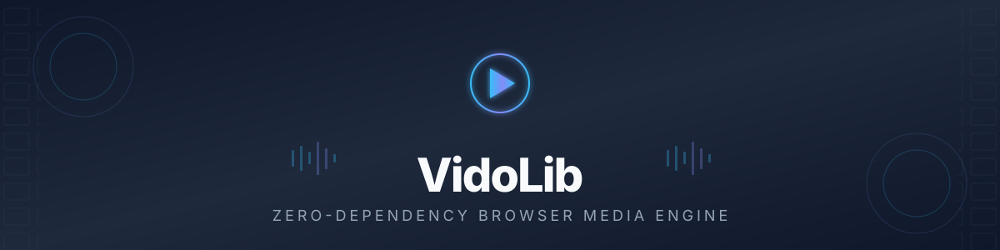
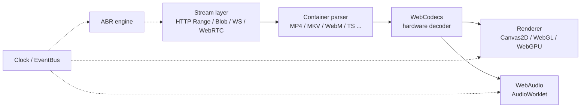

<div align="center">

<!-- Animated Media Focus Header SVG -->


<br/>

**The Native, Zero-Dependency Browser Media Engine**

Hardware-accelerated playback, transcoding, and processing for HLS, DASH, MP4, WebM, MKV, FLV, TS, and subtitles — without a 30 MB FFmpeg WASM binary.

<br/>

[](https://www.typescriptlang.org/)
[](./LICENSING.md)
[](#quick-start)
[](./CONTRIBUTING.md)
[](#testing)

[](https://github.com/swadhinbiswas/VidoLib/commits)
[](https://github.com/swadhinbiswas/VidoLib)
[](https://github.com/swadhinbiswas/VidoLib/issues)
[](https://github.com/swadhinbiswas/VidoLib/graphs/contributors)

<br/>

[🚀 Quick Start](#quick-start) • [⚡ Why No FFmpeg?](#why-no-ffmpeg-wasm) • [🎥 Capabilities](#native-browser-ffmpeg-equivalent-capabilities) • [🏗️ Architecture](#architecture-overview) • [📦 Packages](#package-ecosystem) • [🤝 Contributing](#contributing)

</div>

> [!WARNING]
> VidoLib is in active pre-release development. Packages are built locally from source and are not yet published to npm. APIs may change without notice before v1.0.0.

---

## Overview

Traditional web media players tend to fall into one of two traps:

1. **Monolithic and heavy.** Bundling a 15–40 MB FFmpeg WASM binary that drains mobile battery, adds 1.5–4 seconds to startup, and holds hundreds of megabytes of RAM for the life of the session.
2. **Standard-player lock-in.** Hardcoding layout, network logic, and UI into a single rigid package that's difficult to customize, tree-shake, or extend.

VidoLib takes a runtime-first, modular approach instead:

| Feature | Description |
|---------|-------------|
| 🚀 **Zero-copy and hardware-accelerated** | Direct integration with `WebCodecs`, `WebAudio`/`AudioWorklet`, and `WebGL`/`WebGPU` decode paths |
| ⚡ **Lightweight core** | `@vidolib/core` ships at **3.4 KB gzipped** with zero bundled decoders |
| 🧩 **Fully plugin-based** | Every container parser, ABR algorithm, subtitle renderer, and UI component is an independent package |
| 🛡️ **Patent-safe** | Hardware decoding for licensed codecs (H.264, HEVC, AC-3) keeps patent-pool liability off the application layer |

> [!TIP]
> Only import the plugins you actually use. A minimal HLS-only player can land well under 15 KB gzipped.

---

## Quick Start

VidoLib is currently source-only. Clone and build locally to try it:

```bash
# 1. Clone the repository
git clone https://github.com/swadhinbiswas/VidoLib.git
cd VidoLib

# 2. Install workspace dependencies
npm install

# 3. Build all 22 monorepo packages
npm run build

# 4. Run tests
npx vitest run

# 5. Run fuzz testing
node scripts/fuzz-all.js
```

> [!NOTE]
> The build step compiles each package with esbuild and generates TypeScript declarations.

### Usage in Local Projects

Import directly from the compiled `dist/` output, or link packages into your own workspace:

```typescript
import { Player } from '@vidolib/core';
import { PlayerUI } from '@vidolib/ui';

// Initialize the core runtime
const player = new Player();

// Mount a WCAG 2.1 AA accessible UI
const container = document.getElementById('player-root');
const ui = new PlayerUI(player, container);

// Load and play
await player.load('https://example.com/video.mp4');
player.play();
```

---

## Native Browser FFmpeg-Equivalent Capabilities

VidoLib re-implements the FFmpeg operations most web apps actually need, natively:

<table>
<tr>
<td width="50%" valign="top">

### 🔄 Transcoding
**`@vidolib/transcoder`**
GPU-accelerated client-side video frame encoding to H.264/VP9 via `VideoEncoder`.

```typescript
const encoder = new HardwareVideoEncoder();
await encoder.init({
  codec: 'avc1.4d401f',
  width: 1920, height: 1080,
  bitrate: 2_000_000
}, onPacket);
```

</td>
<td width="50%" valign="top">

### 🎨 Filters
**`@vidolib/filters`**
Real-time GPU Video Filters: Green Screen, Brightness, Contrast, Blur, Watermark.

```typescript
const processor = new VideoFilterProcessor(canvas);
processor.applyFilters(videoFrame, {
  brightness: 1.1,
  contrast: 1.2,
  chromaKeyGreen: true
});
```

</td>
</tr>
<tr>
<td width="50%" valign="top">

### 🔴 Recording
**`@vidolib/recorder`**
Zero-Lag Canvas & Screen Recording to downloadable MP4/WebM files.

```typescript
const recorder = new MediaRecorderPipeline(stream);
recorder.start();
setTimeout(async () => {
  const blob = await recorder.stop();
  recorder.download('video.webm', blob);
}, 10000);
```

</td>
<td width="50%" valign="top">

### 📦 Containers
**`@vidolib/containers`**
Multi-Container Demuxing: MP4, MKV, WebM, AVI, MOV, FLV, TS, PS, OGG, ASF.

```typescript
const registry = new ContainerRegistry();
const result = registry.autoDemux(u8ArrayBuffer);
console.log('Tracks:', result.tracks);
```

</td>
</tr>
</table>

Full technical mapping: [`FFMPEG_CAPABILITIES_ROADMAP.md`](./docs/FFMPEG_CAPABILITIES_ROADMAP.md)

---

## Why No FFmpeg WASM

Full rationale: [`NO_FFMPEG_MANIFESTO.md`](./docs/NO_FFMPEG_MANIFESTO.md)

| Metric | Native VidoLib | FFmpeg WASM players |
|--------|----------------|---------------------|
| Engine download size | **3.4 KB – 30 KB** | 15 MB – 40 MB |
| Startup latency | **< 110 ms** | 1,500 ms – 4,000 ms |
| Battery impact | **Minimal** (OS hardware decoders) | Heavy (CPU-bound WASM threads) |
| Memory footprint | **< 18 MB RAM** | 150 MB – 400 MB RAM |
| Mobile web compatibility | **Native OS decoder support** | Frequently OOM-crashes iOS Safari |

> [!CAUTION]
> The most common production failure mode for FFmpeg WASM players is memory eviction on iOS Safari under WebKit's stricter tab memory limits.

---

## Architecture Overview

A load request flows from the stream layer through demuxing and hardware decode, out to the render and audio sinks:



Deep dive: [`docs/ARCHITECTURE.md`](./docs/ARCHITECTURE.md) · Plugin authoring: [`docs/PLUGINS.md`](./docs/PLUGINS.md)

---

## Package Ecosystem

> [!NOTE]
> All packages compile to `packages/<name>/dist/` inside the monorepo. None are published to npm yet.

| Package | Purpose | Size (gzip) |
|---------|---------|-------------|
| [`@vidolib/core`](./packages/core) | Player, clock, pipeline, event bus | 3.44 KB |
| [`@vidolib/stream`](./packages/stream) | Range HTTP, Blob, File, WS, WebRTC | 2.83 KB |
| [`@vidolib/containers`](./packages/containers) | MP4, MKV, WebM, AVI, MOV, FLV, TS, PS, OGG, ASF | 14.11 KB |
| [`@vidolib/manifest`](./packages/manifest) | HLS (`.m3u8`) and DASH (`.mpd`) parsers | 6.99 KB |
| [`@vidolib/abr`](./packages/abr) | EWMA throughput and buffer-based ABR | 1.75 KB |
| [`@vidolib/codecs`](./packages/codecs) | WebCodecs / native / WASM negotiator | 4.63 KB |
| [`@vidolib/transcoder`](./packages/transcoder) | WebCodecs video/audio encoder | 1.50 KB |
| [`@vidolib/filters`](./packages/filters) | WebGL chroma key, brightness, blur, watermark | 3.34 KB |
| [`@vidolib/recorder`](./packages/recorder) | Canvas and MediaStream MP4/WebM recorder | 1.62 KB |
| [`@vidolib/renderer`](./packages/renderer) | Canvas2D, WebGL, WebGPU backends | 5.36 KB |
| [`@vidolib/subtitle`](./packages/subtitle) | ASS, SRT, VTT subtitle engine | 5.21 KB |
| [`@vidolib/ui`](./packages/ui) | WCAG 2.1 AA accessible glassmorphic UI | 5.49 KB |
| [`@vidolib/worker`](./packages/worker) | Web Worker pipeline with error handling | 2.73 KB |
| [`@vidolib/telemetry`](./packages/telemetry) | Zero-tracking QoE metrics | 1.76 KB |
| [`@vidolib/security`](./packages/security) | Container parser fuzzing & CSP | 1.83 KB |
| [`@vidolib/plugins`](./packages/plugins) | Plugin registry & lifecycle | 1.42 KB |
| [`@vidolib/utils`](./packages/utils) | BitStreamReader, RingBuffer, Logger | 2.90 KB |

---

## Testing

```bash
# Run all unit tests (118 tests)
npx vitest run

# Run fuzz testing (8000 iterations across all demuxers)
node scripts/fuzz-all.js
```

### Test Coverage

| Package | Tests | Status |
|---------|-------|--------|
| `@vidolib/containers` | 26 | ✅ |
| `@vidolib/manifest` | 17 | ✅ |
| `@vidolib/codecs` | 15 | ✅ |
| `@vidolib/subtitle` | 15 | ✅ |
| `@vidolib/filters` | 12 | ✅ |
| `@vidolib/worker` | 12 | ✅ |
| `@vidolib/renderer` | 9 | ✅ |
| `@vidolib/core` | 8 | ✅ |
| `@vidolib/utils` | 2 | ✅ |
| `@vidolib/ui` | 1 | ✅ |

---

## Contributing

| Resource | Description |
|----------|-------------|
| [`CONTRIBUTING.md`](./CONTRIBUTING.md) | Setup, build system, and PR guidelines |
| [`docs/ARCHITECTURE.md`](./docs/ARCHITECTURE.md) | Core engine flow, Web Worker pipelines, memory model |
| [`docs/PLUGINS.md`](./docs/PLUGINS.md) | Build a custom plugin in under 30 lines of code |
| [`docs/ROADMAP.md`](./docs/ROADMAP.md) | Open contributor tasks |

---

## Contributors

<a href="https://github.com/swadhinbiswas/VidoLib/graphs/contributors">
  
</a>

---

## License

Distributed under the **MIT License**. See [`LICENSING.md`](./LICENSING.md) for the full codec licensing guardrails and royalty-free allow-list.

> [!IMPORTANT]
> MIT covers the VidoLib source. It does not grant patent rights for any codec your deployment target doesn't already license — VidoLib sidesteps this by decoding exclusively through OS/browser hardware paths.

---


<div align="center">

**Built with ❤️ using WebCodecs • WebGL • WebGPU • Web Workers**

[Report a bug](https://github.com/swadhinbiswas/VidoLib/issues) · [Request a feature](https://github.com/swadhinbiswas/VidoLib/issues) · [Discussions](https://github.com/swadhinbiswas/VidoLib/discussions)

</div>


